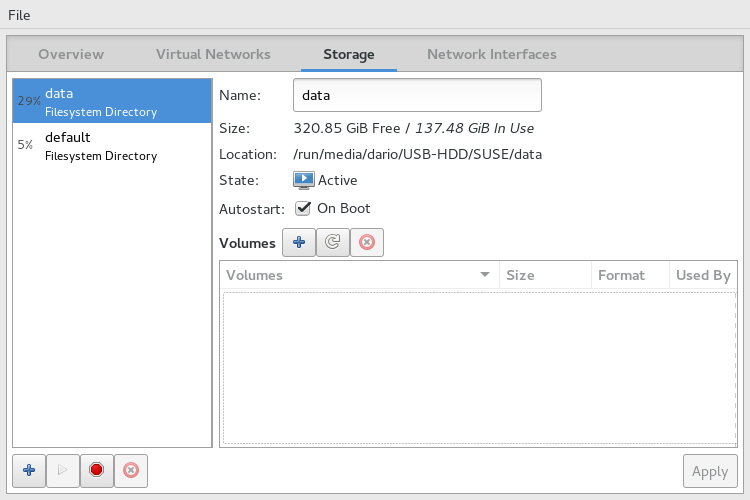

# libvirt-specific configuration

## Choice of the libvirt host

If you use `terraform` on the same host that runs libvirt, nothing needs to be done.

Otherwise, you need to get a libvirt connection URI for your host. Typically it has the form `qemu+ssh://<USER>@<HOST>/system` assuming that `<USER>` has passwordless SSH access to `<HOST>`.

## Choice of networking setup

If you use `terraform` on the same host that runs libvirt and you do not need to expose virtual machines externally, nothing needs to be done.

Otherwise, you need to create a bridge device on the libvirt host to the network you want to expose your machines on ([Ubuntu instructions](https://help.ubuntu.com/community/NetworkConnectionBridge)). Please note the bridge device name.

## Create a `main.tf` file

Create a `main.tf` file:
 - copy `main.tf.libvirt.example` to `main.tf`;
 - keep only hosts you actually need and delete all others. All hosts configured here will be created by default once you run Terraform
 - if you use a remote libvirt host, substitute the `uri` in the `provider` block at the top of the file;
 - if you use bridged networking, add `bridged = true` to any host block that needs it;
   - if you use bridged networking and the bridge name is not `br0`,  `bridge = <DEVICE_NAME>` as well;

## Choose whether to use a `package-mirror` host

You can choose to add a special extra virtual machine named `package-mirror` that will download packages directly from the SUSE engineering network (by default every night, or manually executing `/root/mirror.sh`) and be used exclusively by other virtual machines. That means your setup will be "fully disconnected", not requiring Internet access to operate.

`package-mirror` needs access the SUSE engineering network (or VPN) at package download time.

It also by default requires a different `libvirt` storage pool, because typically we want packages to be stored in a separate disk. By default the pool name is `data` and you can configure it with `virt-manager` like so:



You can also override this setting and keep packages in the same pool as the base images and disks by changing the `libvirt_data_pool` parameter to `default`.

## Accessing the Virtual Machines

All machines come with avahi's mDNS configured by default on the `.tf.local` domain, and a `root` user with password `linux`. Provided your host is on the same network segment of the virtual machines you can access them via:

```
ssh root@suma3pg.tf.local
```

You can add the following lines to `~/.ssh/config` to avoid checking hosts and specifying a username:

```
Host *.tf.local
 StrictHostKeyChecking no
 UserKnownHostsFile=/dev/null
 User root
```

Web access is on standard ports, so `firefox suma3pg.tf.local` will work as expected.

## Customize virtual machine hardware

You can add the following parameters to a `libvirt_host` module in `main.tf` to customize its virtual hardware:
 - `memory = <N>` to set the machine's RAM to N MiB
 - `vcpu = <N>` to set the number of virtual CPUs

## Keep a Virtual Machine turned off

You can add `running = false` to any libvirt host to keep it turned off. This is useful if you want to keep the instance around (ie. not [destroying](https://www.terraform.io/intro/getting-started/destroy.html) it) but not to consume resources.

## Update base OS images

Taint the VM disk(s) you want to update and re-apply the plan:
```
terraform taint -module=images libvirt_volume.sles12sp1
terraform apply
```
