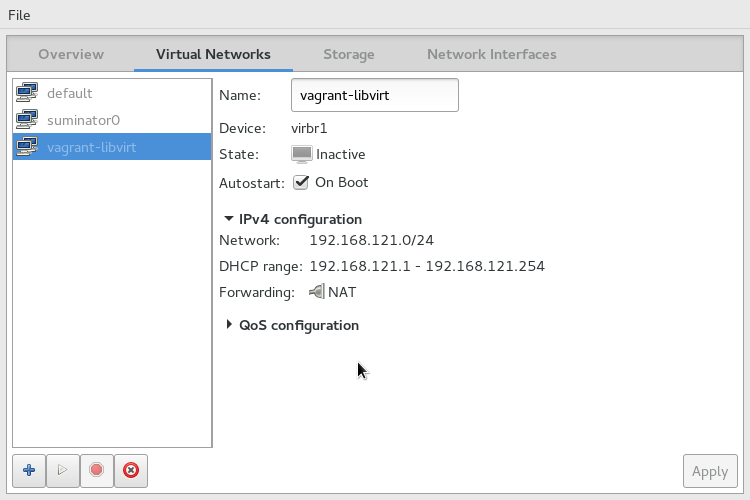

# libvirt-specific configuration

## Set libvirt variables

The default configuration expects a libvirt daemon listening on localhost, with a `default` storage pool and a NAT network called `vagrant-libvirt`. If necessary, create those. If you use `virt-manager` you can set it up like so:



You can override all of these values with [environment variables or variable files](https://www.terraform.io/docs/configuration/variables.html#environment-variables) looking at defaults in `libvirt_host/variables.tf`.

## Create a `main.tf` file

Create a `main.tf` file by copying `main.tf.libvirt.example`. Keep only hosts that you actually need, since all of them will be created by default once you run Terraform.

## Choose whether to use a `package-mirror` host

You can choose to add a special extra virtual machine named `package-mirror` that will download packages directly from the SUSE engineering network (by default every night, or manually executing `/root/mirror.sh`) and be used exclusively by other virtual machines. That means your setup will be "fully disconnected", not requiring Internet access to operate.

`package-mirror` needs access the SUSE engineering network (or VPN) at package download time.

## Accessing the Virtual Machines

All machines come with avahi's mDNS configured by default on the `.tf.local` domain, and a `root` user with password `linux`. Provided your host is on the same network segment of the virtual machines you can access them via:

```
ssh root@suma3pg.tf.local
```

You can add the following lines to `~/.ssh/config` to avoid checking hosts and specifying a username:

```
Host *.tf.local
 StrictHostKeyChecking no
 UserKnownHostsFile=/dev/null
 User root
```

Web access is on standard ports, so `firefox suma3pg.tf.local` will work as expected.

## Customize virtual machine hardware

You can add the following parameters to a `libvirt_host` module in `main.tf` to customize its virtual hardware:
 - `memory = <N>` to set the machine's RAM to N MiB
 - `vcpu = <N>` to set the number of virtual CPUs

## Keep a Virtual Machine turned off

You can add `running = false` to any libvirt host to keep it turned off. This is useful if you want to keep the instance around (ie. not [destroying](https://www.terraform.io/intro/getting-started/destroy.html) it) but not to consume resources.

## Update base OS images

Taint the VM disk(s) you want to update and re-apply the plan:
```
terraform taint -module=images libvirt_volume.sles12sp1
terraform apply
```
